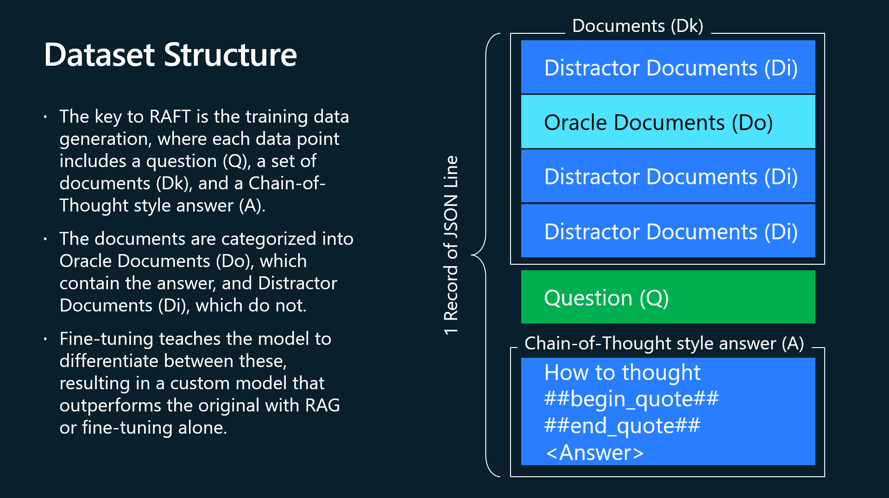
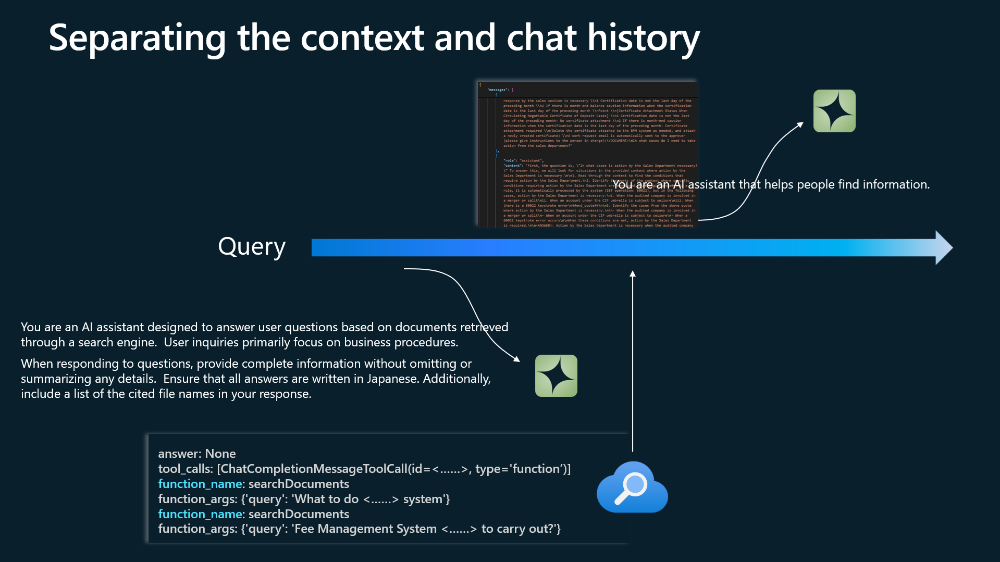

<h1>RAFT Fine Tuning</h1>

02_raft_datagen.ipynb is a copy of **1_raft_datagen.ipynb** in the **[RAFT repository](https://github.com/Azure-Samples/azure-openai-raft).**
  
RAFT uses the training dataset to provide thought process for getting to the answers. 
The structure of the training dataset is shown in Figure 1. 
 
 

 
 
Since the generated training dataset does not include system prompts, we do not include them during inference either. Also, make sure that you don't include the log of function calls in the chat history, so keep the assistants separate. Figure 2
 
 

